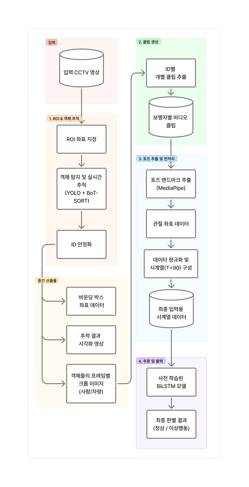

# CCTV 기반 장애인 전용 주차구역 보행 분석 및 부정 이용 탐지

학회(KHUDA) 8기 심화 컨퍼런스 최우수상

---

## 1. 개요

본 시스템은 **CCTV 영상**에서 장애인 전용 주차구역에 주차된 차량과 하차 인물을 추적하고, **보행 특성**을 비식별적으로 분석하여 **해당 차량에 보행상 장애 이용자가 탑승했을 가능성**을 추정하는 컴퓨터 비전 기반 시스템입니다.

### 문제 인식

장애인 전용 주차구역의 부정 이용은 지속적으로 증가하지만, 기존 단속은 주로 **표지나 차량 번호판 중심**으로 이루어져 **실제 보행상 장애 이용자가 탑승했는지**를 반영하기 어렵습니다. 본 프로젝트는 신원이나 번호판이 아닌 **보행 패턴(행동 정보)**에 기반해 단속을 보조할 수 있는 판단 근거를 제안합니다.

  

### 본 프로젝트의 방향

- **객체 추적:** ROI 내 차량 및 보행자를 YOLO + BoT-SORT로 추적하고, ID 안정화로 하차 인물 시퀀스를 확보합니다.
- **보행 분석:** MediaPipe Pose로 3D 스켈레톤을 추출하고, 도메인 전처리 후 LSTM으로 Normal / Abnormal Gait를 판별합니다.
- **비식별성:** 판단은 **관절 좌표 시퀀스** 기반이며, 개인 식별 정보를 직접 사용하지 않는 설계를 지향합니다.

### 시스템 요약

**Input:** 단일 프레임이 아닌 **고정 길이 Pose 시퀀스**(T=90)로 보행 패턴을 모델링합니다.

**Detecting & Tracking:** **YOLO11n** + **BoT-SORT**(`botsort.yaml`)로 Multi Object Detection을 수행하고, **`IDStabilizer`**에서 IoU(0.55) · 거리(0.30) · HSV 외형(0.15) 가중합으로 `stable_id`를 보정합니다.

**Pose:** **MediaPipe Pose Landmarker Heavy** (world landmarks)로 프레임별 3D 키포인트를 추출합니다.

**Classification:** **양방향 LSTM(hidden=128, 2 layers)** + **LayerNorm + MLP Head**로 2-class softmax 추론합니다.

---

## 2. 기술 스택 

| 구분 | 기술 |
|------|------|
| **Vision & AI** | PyTorch, Ultralytics YOLO, OpenCV, MediaPipe Tasks (Pose Landmarker) |
| **Tracking** | BoT-SORT, 커스텀 ID 안정화  |
| **Model Architecture** | BiLSTM + FC Head  |
| **전처리** | NumPy, Pandas, 뼈 길이 기반 스케일링  |

---

## 3. 시스템 파이프라인

1. **데이터 입력 및 ROI** 사용자가 첫 프레임에서 장애인 주차구역 다각형 ROI 지정 
2. **객체 검출·추적** YOLO로 `person` / `car·truck·bus` 검출, BoT-SORT로 MOT, ROI 마스크로 차량 필터링 
3. **ID 안정화** IoU/거리/HSV(H,S) 히스토그램으로 `raw_id` → `stable_id` 재할당 
4. **하차 인물 선별** ROI 내 차량에서 하차한 보행자만 후속 파이프라인 대상으로 매칭
5. **크롭 이미지 영상화** ID별 crop을 mp4로 재구성, 구간 선택 및 누락 프레임 보간
6. **3D Pose** 보행자 mp4에서 world landmarks 추출 → `.npz` 
7. **전처리** 33→11 관절 선택, SpineBase 기준 정렬, 뼈 길이 스케일링, \(T=90\) 고정·패딩 
8. **보행 분류** CSV → LSTM 추론, Normal vs Abnormal

### End-to-End 흐름

  

---

## 4. 주요 엔지니어링 포인트 

### 4.1. 시계열 보행 패턴 반영

- **문제:** 단일 프레임만으로는 보행 이상을 안정적으로 구분하기 어렵습니다.
- **해결:** MediaPipe 시퀀스를 **고정 길이 90프레임**으로 맞춘 뒤 BiLSTM으로 시간축 패턴을 모델링합니다.
- **구현:** `TARGET_T = 90`, 부족 시 zero-padding, 초과 시 crop 

### 4.2. 도메인 특화 Pose 전처리

- **Translation 제거:** 양 Hip 중점을 **SpineBase**로 두고 모든 관절을 상대 좌표로 이동.
- **Scale normalization:** 다리 뼈 4개(Hip–Knee, Knee–Ankle 좌우) 길이의 대표값으로 전체 좌표를 나누어 키, 카메라 거리 변동 등을 완화.
- **품질 필터:** 뼈 길이가 `[0.05, 1.20]` 밖이거나 극단값인 프레임은 마스킹 후 **선형 보간**으로 복원.

### 4.3. ID Switch 완화

- BoT-SORT `raw_id`에 대해 **최소 IoU·최대 중심거리(정규화)**로 후보를 거르고, 가중 점수로 Hungarian 매칭 후 비용 임계값으로 매칭을 제한합니다.
- 외형은 **HSV 2채널(H,S) 히스토그램 상관**으로 유사도를 계산해 조도 변화에 상대적으로 강하게 설계했습니다.

---

## 5. 실제 구현 영상

  

---

## 6. 팀

| 이름 |
|------|
| 이승준 |
| 표지훈 |
| 박지연 |
| 장승민 |
| 이지민 |
| 송민선 |
| 탁진형 |
| 박진오 |
